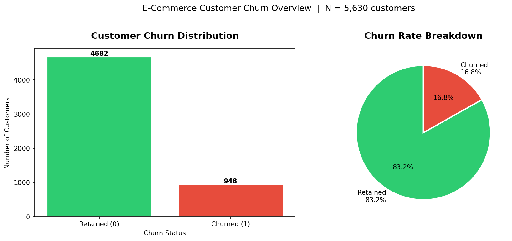
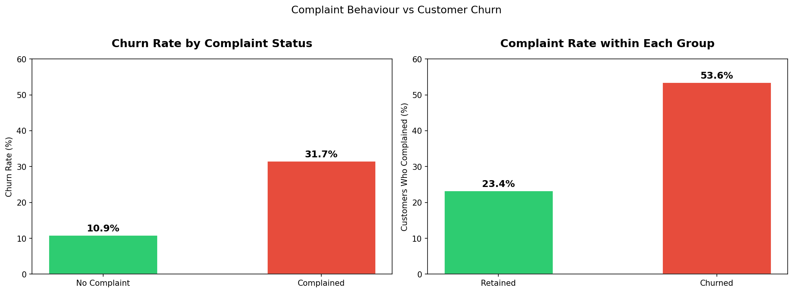
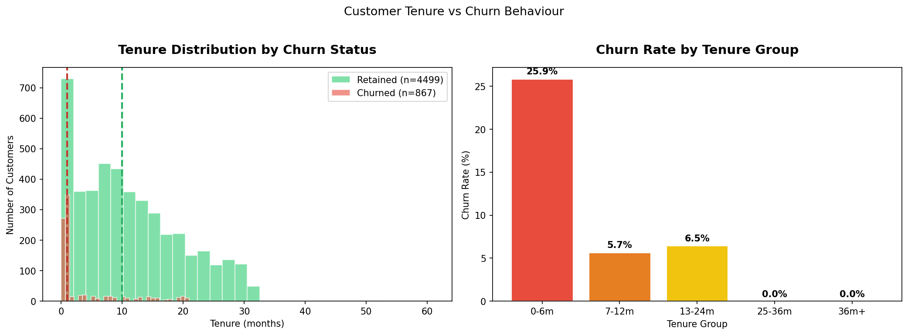
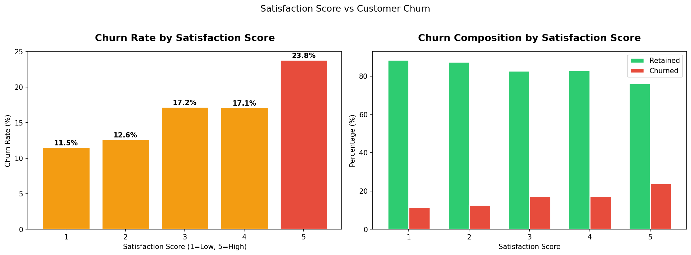
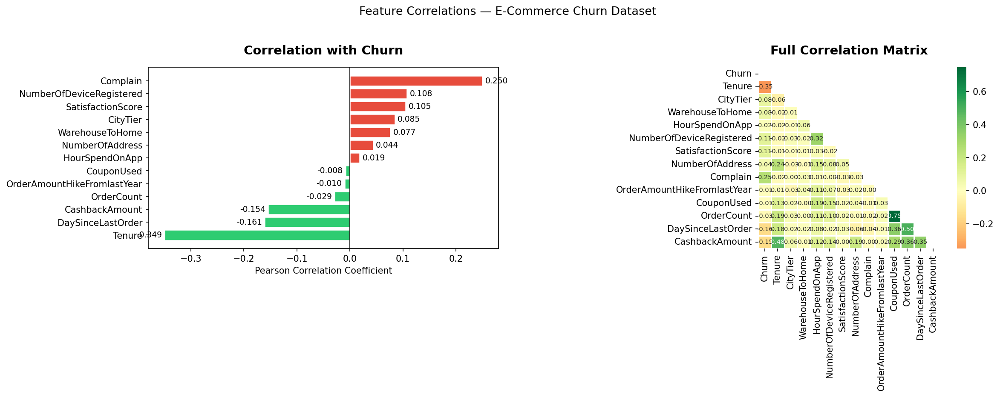
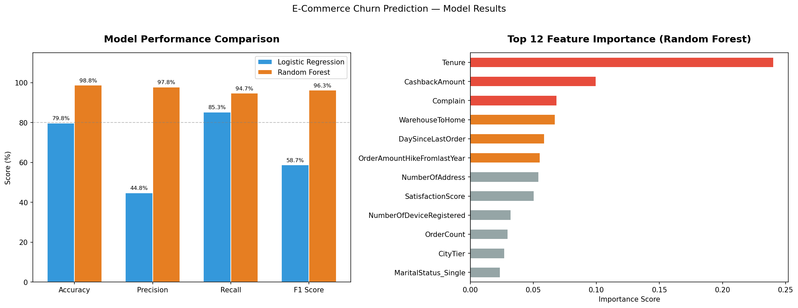

# 🛒 E-Commerce Customer Churn Analysis & Prediction

> **Which customers are about to leave — and why?**  
> An end-to-end data analysis project identifying the key drivers of customer churn in an e-commerce platform, combining exploratory analysis, feature engineering, and machine learning to deliver actionable retention strategies.

---

## 📌 Business Problem

Customer acquisition costs 5–7× more than retention. Yet most e-commerce platforms lack a systematic way to identify **which customers are at risk of churning before they leave**.

This project answers two core business questions:
1. **What behaviours and attributes predict customer churn?**
2. **How accurately can we identify at-risk customers to enable proactive intervention?**

---

## 💡 Key Findings

| Finding | Evidence |
|---------|---------|
| **New customers are the highest-risk group** | Churn rate of 25.9% in first 6 months vs 0% after 25 months |
| **Complaints are the strongest churn signal** | Customers who complained churn at 31.7% vs 10.9% for non-complainers |
| **Cashback drives retention** | CashbackAmount is the 2nd most important predictive feature (importance: 0.10) |
| **Tenure is the #1 predictive feature** | Importance score of 0.24 — far ahead of all other variables |
| **Satisfaction score is counterintuitive** | Higher satisfaction scores correlate with *higher* churn — suggesting measurement or timing issues worth investigating |

---

## 🗂️ Dataset

| Attribute | Detail |
|-----------|--------|
| **Source** | [Kaggle — E-Commerce Customer Churn](https://www.kaggle.com/datasets/ankitverma2010/ecommerce-customer-churn-analysis-and-prediction) |
| **Customers** | 5,630 |
| **Features** | 20 (behavioural, transactional, demographic) |
| **Target** | `Churn` (0 = Retained, 1 = Churned) |
| **Churn Rate** | 16.8% (imbalanced dataset) |

**Key variables:**

| Variable | Description |
|----------|-------------|
| `Tenure` | Months since first purchase |
| `Complain` | Whether customer filed a complaint (0/1) |
| `CashbackAmount` | Total cashback received |
| `DaySinceLastOrder` | Days since last purchase |
| `SatisfactionScore` | Customer satisfaction rating (1–5) |
| `HourSpendOnApp` | Daily hours spent on the app |

---

## 🔍 Exploratory Data Analysis

### Churn Overview
16.8% of customers churned — creating a class imbalance that required careful handling before modeling.



### Complaint Behaviour
Customers who complained are **2.9× more likely to churn**. Over half of all churned customers (53.6%) had filed a complaint.



### Tenure Effect
The first 6 months are the critical retention window. Churn drops sharply after month 12 and reaches **0% beyond 25 months**.



### Satisfaction Score — A Counterintuitive Finding
Contrary to expectations, customers with higher satisfaction scores showed higher churn rates. This warrants further investigation into how and when satisfaction is measured.



### Feature Correlations
`Tenure` (−0.35) and `Complain` (+0.25) are the strongest linear predictors of churn.



---

## ⚙️ Methodology

### Data Preprocessing
- **Missing value imputation:** Median imputation for 7 numeric features (4–5% missing each)
- **Encoding:** One-Hot Encoding for 5 categorical variables (20 → 29 features)
- **Standardisation:** StandardScaler applied to all numeric features
- **Class imbalance:** Oversampling (random resampling) applied **only to the training set** after train-test split — avoiding data leakage

> ⚠️ **Note on data leakage:** Oversampling must be applied *after* the train-test split. Applying it before would allow the model to "see" duplicated test samples during training, producing artificially inflated metrics.

### Modeling

| Model | Role | Rationale |
|-------|------|-----------|
| Logistic Regression | Baseline | Simple, interpretable; establishes minimum bar |
| Random Forest | Primary model | Handles non-linear relationships; outputs feature importance |

**Train/Test Split:** 80/20, stratified by churn label

---

## 📊 Model Results

| Model | Accuracy | Precision | Recall | F1 Score |
|-------|---------|-----------|--------|----------|
| Logistic Regression | 79.75% | 44.75% | 85.26% | 58.70% |
| **Random Forest** | **98.76%** | **97.83%** | **94.74%** | **96.26%** |

> **Why F1 Score matters here:** With an imbalanced dataset, accuracy alone is misleading. F1 balances Precision and Recall — critical when the cost of missing a churning customer (false negative) is high.

> **Why Recall is prioritised:** In a retention context, it is better to flag some non-churners for outreach than to miss customers who are genuinely leaving.



---

## 🎯 Top Predictive Features (Random Forest)

| Rank | Feature | Importance | Business Implication |
|------|---------|------------|---------------------|
| 1 | `Tenure` | 0.24 | New customers need intensive onboarding support |
| 2 | `CashbackAmount` | 0.10 | Cashback programmes are effective retention tools |
| 3 | `Complain` | 0.07 | Complaint resolution is a direct churn prevention lever |
| 4 | `WarehouseToHome` | 0.06 | Delivery experience affects long-term loyalty |
| 5 | `DaySinceLastOrder` | 0.06 | Purchase recency is an early warning signal |

---

## 💼 Business Recommendations

Based on the analysis, three targeted interventions are recommended:

**1. New Customer Onboarding Programme (addresses Tenure)**
Focus retention resources on customers in their first 6 months. Personalised onboarding, check-in emails, and first-purchase incentives can significantly reduce early churn.

**2. Complaint Fast-Track Resolution (addresses Complain)**
Customers who complain churn at nearly 3× the baseline rate. A dedicated fast-response team for complaint resolution — with follow-up satisfaction checks — could directly reduce churn.

**3. Cashback Optimisation (addresses CashbackAmount)**
Cashback is the second most predictive retention feature. Targeted cashback offers for customers showing early churn signals (low recency, recent complaint) could be a cost-effective intervention.

---

## 🛠️ Technical Stack

| Tool | Purpose |
|------|---------|
| **Python 3.13** | Primary language |
| `pandas` / `numpy` | Data manipulation |
| `matplotlib` / `seaborn` | Visualisation |
| `scikit-learn` | Preprocessing, modeling, evaluation |
| **Jupyter Notebook** | Development environment |
| **Anaconda** | Environment management |

---

## 📂 Repository Structure

```
ecommerce-churn-analysis/
│
├── data/
│   └── E Commerce Dataset.xlsx    # Source dataset (Kaggle)
│
├── output/
│   ├── 01_churn_distribution.png
│   ├── 02_complaint_vs_churn.png
│   ├── 03_tenure_vs_churn.png
│   ├── 04_satisfaction_vs_churn.png
│   ├── 05_correlation_heatmap.png
│   └── 06_model_results.png
│
├── 01_eda.ipynb                   # Exploratory Data Analysis
├── 02_preprocessing.ipynb         # Data cleaning & feature engineering
├── 03_modeling.ipynb              # Model training & evaluation
└── README.md
```

---

## ▶️ How to Run

```bash
# 1. Clone the repository
git clone https://github.com/alexanderlau/ecommerce-churn-analysis.git
cd ecommerce-churn-analysis

# 2. Install dependencies
pip install pandas numpy matplotlib seaborn scikit-learn openpyxl jupyter

# 3. Launch Jupyter
jupyter notebook

# 4. Run notebooks in order:
#    01_eda.ipynb → 02_preprocessing.ipynb → 03_modeling.ipynb
```

---

## 📌 Limitations & Future Work

- **Oversampling vs SMOTE:** Random oversampling was used for simplicity. SMOTE (Synthetic Minority Oversampling Technique) generates synthetic samples rather than duplicating existing ones, which may reduce overfitting risk and is worth exploring.
- **Satisfaction Score anomaly:** The counterintuitive positive correlation between satisfaction and churn warrants deeper investigation — possibly a data collection or timing issue.
- **Model interpretability:** SHAP values could be used to explain individual predictions, making the model more actionable for business teams.
- **Temporal validation:** A time-based train/test split (older data to train, recent data to test) would better simulate real-world deployment conditions.

---

## 👤 Author

**Alexander Lau Poung Jie**
- 📊 Interests: Data Analysis, Business Intelligence, Customer Analytics
- 🎓 Statistics — National Chengchi University

---

*Dataset: Ankit Verma (2021). E-Commerce Customer Churn Analysis and Prediction. Kaggle.*
